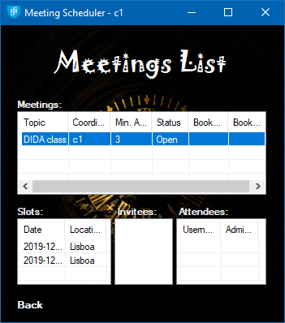

# MSDAD

**Course:** Design and Implementation of Distributed Applications  
**University:** Instituto Superior Técnico  
**Academic year:** 2019-20

### Team

- 73891 - David Gonçalves ([david.s.goncalves@tecnico.ulisboa.pt](mailto:david.s.goncalves@tecnico.ulisboa.pt))
- 87630 - André Moreira ([andre.moreira@tecnico.ulisboa.pt](mailto:andre.moreira@tecnico.ulisboa.pt))
- 94104 - Leonardo Troeira ([leonardo.troeira@tecnico.ulisboa.pt](mailto:leonardo.troeira@tecnico.ulisboa.pt))

### Links

[MSDAD FAQ](https://docs.google.com/document/d/1MTVyKDmzUeJcLIJTsvw5frO-d6pnYSTjL2flAF0IC2k/edit)

## Assignment

See [documentation/Assignment.md](documentation/Assignment.md)

## Report

See [documentation/report/T19_Mon_1330_0-14_report.pdf](documentation/report/T19_Mon_1330_0-14_report.pdf)

## Coding conventions

See [documentation/Conventions.md](documentation/Conventions.md)

## FAQ

See [documentation/FAQ.md](documentation/FAQ.md)

## Run Instructions

*Note: Service addresses (aka. Remoting Address) are in the form `tcp://ip:port/channel`*

### Puppet Master

The Puppet Master is the program we use to start and manage servers and clients. It can also run a script file to automate this task (specification in the assignment). The script file can also contain comments (start with ';'). In order for the PM to work, a PCS must be running on the machine where processes will be created. The PM listens on TCP port 10001. For starting servers and clients, their remoting addresses must be provided and are what the user decides.

   

### Process Creation Service

This process runs on the machines where servers and clients will be launched. It listens on TCP port 10000.

### Server

The server program **must** receive 5 arguments:

- Server ID
- Server service address
- Server max. tolerated faults
- Server min. delay
- Server max. delay

### Client

The client program **must** receive 3 arguments:

- Client username
- Client service address
- Server service address

And may receive one 4th optional argument, a script file path (specification in the assignment). If running with Visual Studio, this can be our test script file `../../script.txt`. The script file can also contain comments (start with ';').

    

### Visual Studio startup projects

### Executing scripts

Both the PM and Client may execute scripts. Two scripts for the PM and two scripts for the Client were provided to us by the teacher. They are:

**PM scripts:**

- [pms1.txt](PM/pms1.txt) - This script contains two `AddRoom` commands before any server is created, which we do not support in our solution, hence we use pms1-sa.txt which creates the servers first.
- [pms1-sa.txt](PM/pms1-sa.txt) - We've changed the path of the client scripts to be found on 2 directories above where the Client's exe is placed. This is because we use git version-control and the `bin` folder is ignored.

**Client scripts:**

- [cs1.txt](Client/cs1.txt) - To be run by the first client.
- [cs2.txt](Client/cs2.txt) - To be run by the second client.

## Not implemented

- Client functionality
  - ~~list meetings should show rooms available for slot~~
  - ~~sign in form in case arguments are not passed at startup~~
- Fault tolerance
  - Currently our system allows N-1 servers to fail because our diffusion algorithm is not very efficient.
- Meeting diffusion algorithm
  - Clients should inform other clients instead of having the servers taking care of all this.