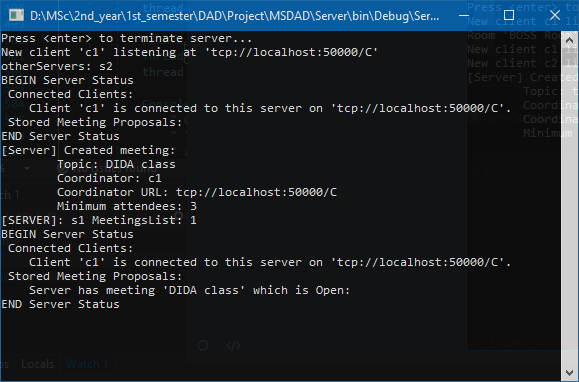
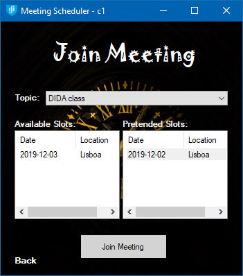

# MSDAD

**Course:** Design and Implementation of Distributed Applications  
**University:** Instituto Superior Técnico  
**Academic year:** 2019-20

### Team

- 73891 - David Gonçalves ([david.s.goncalves@tecnico.ulisboa.pt](mailto:david.s.goncalves@tecnico.ulisboa.pt))
- 87630 - André Moreira ([andre.moreira@tecnico.ulisboa.pt](mailto:andre.moreira@tecnico.ulisboa.pt))
- 94104 - Leonardo Troeira ([leonardo.troeira@tecnico.ulisboa.pt](mailto:leonardo.troeira@tecnico.ulisboa.pt))

### Links

[MSDAD FAQ](https://docs.google.com/document/d/1MTVyKDmzUeJcLIJTsvw5frO-d6pnYSTjL2flAF0IC2k/edit)

## Assignment

See [documentation/Assignment.md](documentation/Assignment.md)

## Coding conventions

See [documentation/Conventions.md](documentation/Conventions.md)

## FAQ

See [documentation/FAQ.md](documentation/FAQ.md)

## Run Instructions

*Note: Service addresses (aka. Remoting Address) are in the form `tcp://ip:port/channel`*

### Puppet Master

The Puppet Master is the program we use to start and manage servers and clients. It can also run a script file to automate this task (specification in the assignment). The script file can also contain comments (start with ';'). In order for the PM to work, a PCS must be running on the machine where processes will be created. The PM listens on TCP port 10001. For starting servers and clients, their remoting addresses must be provided and are what the user decides.

   

### Process Creation Service

This process runs on the machines where servers and clients will be launched. It listens on TCP port 10000.

### Server

The server program **must** receive 5 arguments:

- Server ID
- Server service address
- Server max. tolerated faults
- Server min. delay
- Server max. delay

### Client

The client program **must** receive 3 arguments:

- Client username
- Client service address
- Server service address

And may receive one 4th optional argument, a script file path (specification in the assignment). If running with Visual Studio, this can be our test script file `../../script.txt`. The script file can also contain comments (start with ';').

   

### Visual Studio startup projects

## Checkpoint

**Not yet implemented:**

- Client functionality not 100%
  - server inform client when someone joins a meeting and when a meeting is closed or cancelled
    - use this info for list page and join and close combo boxes
  - ~~list meetings should show rooms available for slot~~
  - sign in form in case arguments are not passed at startup
- Close meeting (error checks, review etc)
  - Room class should have list of dates when it is booked
  - Check minimum participants
  - Check location and date that maximizes participants (based on preferred slot and room capacities)
  - Exclude clients that cannot go to that location / date
  - Exclude clients randomly if room capacity isn't enough
- Client list in script?
- Server replication
- PM Status command
- Fault tolerance
- Meeting diffusion algorithm